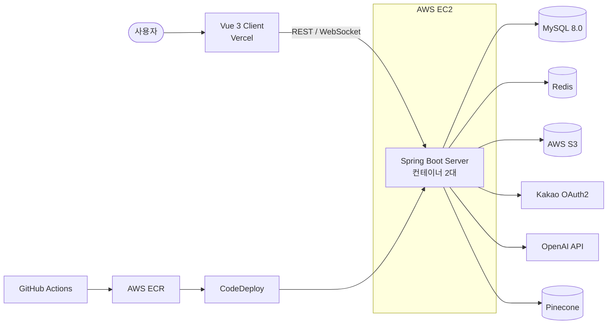

<h1 align="center">✈️ 갈래말래 (Gallae-Mallae) Server</h1>

<p align="center">
  <b>SSAFY 14기 관통 프로젝트</b>
</p>

<br/>

<p align="center">
  <b>AI 추천부터 실시간 일정 조율까지,</b><br/>
  <b>함께 그리는 완벽한 여행</b>
</p>

<br/>

<p align="center">
  지도 탐색, AI 맞춤 추천, 실시간 협업으로<br/>
  친구들과 쉽고 빠르게 여행 계획을 세우는 웹 서비스, <b>갈래말래</b>
</p>

<br/>

<p align="center">
  <a href="https://gallae-mallae-client.vercel.app"></a>
  <a href="https://github.com/Gallae-Mallae/Gallae-Mallae-Client"></a>
</p>

<p align="center">
  
  
  
  
  
</p>

<br/>

<p align="center">
  
</p>

<br/>

## 📑 목차

<p align="center">
  <a href="#project-info"><b>🚀 프로젝트 정보</b></a> &nbsp;&nbsp;|&nbsp;&nbsp;
  <a href="#team"><b>🔥 Team</b></a> &nbsp;&nbsp;|&nbsp;&nbsp;
  <a href="#why-gallae-mallae"><b>💬 왜 갈래말래인가</b></a> &nbsp;&nbsp;|&nbsp;&nbsp;
  <a href="#features"><b>✨ 주요 기능</b></a> &nbsp;&nbsp;|&nbsp;&nbsp;
  <a href="#structure"><b>📂 프로젝트 구조</b></a> <br><br>
  <a href="#core-pipeline"><b>⚙️ 코어 파이프라인</b></a> &nbsp;&nbsp;|&nbsp;&nbsp;
  <a href="#tech-stack"><b>🛠 기술 스택</b></a> &nbsp;&nbsp;|&nbsp;&nbsp;
  <a href="#api"><b>📌 주요 API</b></a> &nbsp;&nbsp;|&nbsp;&nbsp;
  <a href="#architecture"><b>🏗 System Architecture</b></a> &nbsp;&nbsp;|&nbsp;&nbsp;
  <a href="#getting-started"><b>🏁 시작 가이드</b></a>
</p>

<br/>

## 🚀 프로젝트 정보 <a id="project-info"></a>

<br/>

| 항목 | 상세 내용 |
|:---:|:---|
| 🗓️ **진행 기간** | 2025.11.19 ~ 2025.12.30 (약 6주) |
| 💻 **플랫폼** | Web |
| 👥 **개발 인원** | 4명 |
| 🏢 **기관** | 삼성 청년 SW·AI 아카데미 SSAFY 14기 |
| 🧩 **프로젝트 형태** | Server / Client 저장소 분리 (이 저장소는 Server) |
| 🌐 **배포 서비스** | https://gallae-mallae-client.vercel.app |
| 🎨 **Frontend 저장소** | [Gallae-Mallae/Gallae-Mallae-Client](https://github.com/Gallae-Mallae/Gallae-Mallae-Client) |

> 이 저장소에는 백엔드 코드만 있습니다. 화면과 프론트엔드 코드는 위 링크에서 확인할 수 있습니다.

<br/>

## 🔥 Team <a id="team"></a>

| Profile | Responsibilities |
|:---:|:---|
| <br>**송성현**<br><sub>Infra / Backend</sub><br>[@SHSong99](https://github.com/SHSong99) | - 카카오 OAuth2 소셜 로그인 및 JWT 인증 구조 구현<br>- 리프레시 토큰 재발급과 재발급 동시성 처리<br>- Docker 기반 로컬 개발 환경 구성<br>- GitHub Actions · ECR · CodeDeploy CI/CD 파이프라인 구축<br>- 장소 폴더 API, 전역 예외 처리 |
| <br>**김상지**<br><sub>Backend</sub><br>[@theundergroundt](https://github.com/theundergroundt) | - 도메인형 패키지 구조 설계 및 전체 엔티티 초기 구축<br>- 여행 계획 · 초대 코드 · 스케줄 블록 · 메모 API 구현<br>- WebSocket(STOMP) 실시간 일정 동기화와 Redis 락 기반 동시 편집 제어<br>- 스크랩 폴더 · 스크랩 API, Jsoup 링크 메타데이터 스크래핑<br>- 프로필 수정, soft delete 탈퇴 및 재로그인 시 계정 복구<br>- AWS S3 설정 및 여행 대표 이미지 적용 |
| <br>**이승엽**<br><sub>Backend</sub><br>[@DooDooLee](https://github.com/DooDooLee) | - MyBatis 설정 및 관광지 검색 쿼리 구현<br>- Geohash 클러스터링 기반 지도 검색 API<br>- 관광지 좋아요 API, 좋아요순 목록 페이지네이션<br>- Pinecone · OpenAI 기반 RAG 챗봇 구현 |
| <br>**이지원**<br><sub>Frontend</sub><br>[@zwongraphic](https://github.com/zwongraphic) | - Vue 3 기반 클라이언트 화면 및 컴포넌트 구현<br>- 일정 타임테이블, 스케줄 블록 드래그 앤 드롭 UI<br>- 서버 WebSocket(STOMP) 초기 설정 |

<br/>

## 💬 왜 갈래말래인가 <a id="why-gallae-mallae"></a>

여행을 계획할 때마다 쏟아지는 정보와 친구들 간의 의견 조율로 지치신 적 없으신가요?

- 가고 싶은 곳은 블로그, 유튜브, 지도 앱에 흩어져 있어 한곳에 모으기 어렵습니다.
- 일정표는 한 사람이 정리하고 나머지는 메신저로 의견만 보내게 됩니다.
- 장소가 너무 많아 지도에서 원하는 곳을 찾는 것부터 느리고 번거롭습니다.
- 어디를 갈지 막막할 때 취향에 맞는 추천을 받기 어렵습니다.

**갈래말래**는 이 과정을 하나의 흐름으로 연결했습니다. 링크를 붙여넣어 가고 싶은 곳을 모으고, 지도와 AI 챗봇으로 장소를 찾고, 초대 코드로 친구를 불러 같은 시간표를 실시간으로 함께 완성합니다.

<br/>

## ✨ 주요 기능 <a id="features"></a>

### 🤝 실시간 협업 플래너

- **초대 코드 참여**: 여행을 만들면 초대 코드가 발급되고, 친구는 코드 하나로 여행에 참여합니다. 나갔던 멤버도 다시 들어올 수 있습니다.
- **타임라인 일정표**: 여행 일자(Day N)별 시간표에 일정 블록을 만들고, 옮기고, 길이를 조절합니다.
- **실시간 동기화**: 한 사람이 블록을 바꾸면 WebSocket(STOMP)으로 같은 여행의 모든 참여자 화면에 바로 반영됩니다.
- **동시 편집 제어**: 여러 명이 동시에 수정해도 일정이 꼬이지 않도록 여행 단위 Redis 락으로 순서를 보장합니다.
- **블록별 메모**: 일정 블록마다 메모를 남기고 순서를 바꿀 수 있습니다.

### 📁 스마트 스크랩

- **링크만 붙여넣기**: 블로그나 영상 링크를 넣으면 제목, 대표 이미지, 설명을 자동으로 가져와 미리보기 카드로 저장합니다.
- **사이트별 대응**: 네이버 블로그와 유튜브처럼 일반 방식으로 미리보기를 얻기 어려운 사이트도 처리합니다.
- **폴더 관리**: 스크랩을 폴더로 묶어 관리하고, 본인 소유의 폴더와 스크랩만 조회·수정할 수 있습니다.

### 🗺️ 대규모 장소 탐색

- **지도 클러스터링**: 전국 약 25만 개 장소를 Geohash로 묶어, 지도 범위에 장소가 많으면 클러스터로, 적으면 개별 마커로 보여줍니다.
- **검색**: MySQL ngram Full-Text 검색과 MyBatis 동적 쿼리로 키워드·지역·유형을 조합해 찾습니다.
- **좋아요와 장소 폴더**: 마음에 드는 장소에 좋아요를 누르고, 폴더에 담아 모아 볼 수 있습니다. 좋아요가 많은 순으로도 탐색할 수 있습니다.

### 🤖 AI 맞춤 여행지 추천

- **RAG 챗봇**: "몸 지지고 싶어" 같은 모호한 말도 검색 키워드로 바꿔, 실제 장소 데이터에 근거한 추천을 답합니다.
- **근거 없는 답변 방지**: 유사도가 낮은 검색 결과는 걸러내고, 근거가 없으면 추천하지 않습니다.

### 🔐 간편 로그인

- **카카오 소셜 로그인**: OAuth2와 JWT 기반으로 로그인하고, 리프레시 토큰은 Redis에 보관해 재발급합니다.
- **탈퇴와 복구**: 탈퇴는 soft delete로 처리하며, 같은 계정으로 다시 로그인하면 복구됩니다.

<br/>

## 📂 프로젝트 구조 <a id="structure"></a>

```text
src/main/java/com/practice/OAuth2/
├── domain/
│   ├── ai/          # RAG 기반 AI 추천 서비스 (OpenAI, Pinecone 연동)
│   ├── attraction/  # 관광지 검색, 클러스터링, 좋아요 및 장소 폴더 관리
│   ├── auth/        # JWT 기반 인증, 토큰 재발급, 로그아웃
│   ├── plan/        # 여행 계획, 스케줄 블록, 메모, 실시간 협업 (WebSocket)
│   ├── scrap/       # 외부 링크 스크랩 및 메타데이터 추출
│   └── user/        # 사용자 프로필 관리 및 탈퇴·복구
├── global/
│   ├── common/      # 공통 Response 및 BaseEntity
│   ├── config/      # Redis, Security, WebSocket, S3 설정
│   ├── exception/   # 전역 예외 처리 (GlobalExceptionHandler)
│   ├── security/    # JWT 필터, OAuth2 핸들러, UserPrincipal
│   └── util/        # Cookie, Token 관리 유틸리티
└── resources/
    └── mapper/      # MyBatis XML 매퍼 (관광지 검색 최적화)
```

<br/>

## ⚙️ 코어 파이프라인 <a id="core-pipeline"></a>

갈래말래 서버의 핵심 흐름 네 가지입니다.

<br/>

### 🤝 1. 실시간 일정 편집 파이프라인

> 여러 사용자가 같은 시간표를 동시에 고쳐도, 모두가 같은 최신 상태를 보도록 합니다.

* **Step 1. 편집 요청 수신**
  블록 생성, 이동, 크기 조절, 삭제 요청을 REST API로 받습니다.
* **Step 2. 여행 단위 락 획득**
  Redis `SETNX`로 `plan:lock:{planId}` 락을 잡습니다. TTL 3초를 두어 서버 장애 시에도 락이 남지 않습니다.
* **Step 3. DB 반영**
  변경 내용을 `saveAndFlush`로 즉시 반영합니다.
* **Step 4. 커밋 후 알림 발행**
  트랜잭션 커밋이 끝난 뒤(`afterCommit`) `/topic/plans/{planId}`로 `BLOCK_MOVED` 같은 이벤트를 보냅니다. 알림이 DB 저장보다 먼저 도착해 다른 사용자가 변경 전 데이터를 보는 문제를 막습니다.
* **Step 5. 락 해제**
  트랜잭션 종료 시점(`afterCompletion`)에 락을 풀어 다음 요청을 받습니다.

<br/>

### 📁 2. 링크 스크랩 파이프라인

> 링크 하나로 제목, 대표 이미지, 설명이 담긴 스크랩 카드를 만듭니다.

* **Step 1. 링크 입력**
  스크랩을 만들거나 링크를 수정하면 자동으로 스크래핑을 시작합니다.
* **Step 2. 사이트 판별**
  유튜브는 영상 ID로 썸네일 주소를 조합하고, 네이버 블로그는 `iframe` 안의 실제 본문 주소를 다시 요청합니다.
* **Step 3. 메타데이터 추출**
  Jsoup으로 HTML을 가져와 `og:` → `twitter:` → 일반 태그 순서로 제목, 이미지, 설명을 찾습니다.
* **Step 4. 기본값 처리**
  추출에 실패하면 기본 이미지와 기본 문구로 저장합니다.

<br/>

### 🤖 3. AI 챗봇 응답 파이프라인 (RAG)

> 사용자의 자연어 질문을 해석하고, 실제 장소 데이터를 근거로 추천합니다.

* **Step 1. 검색어 정제**
  모호한 질문을 GPT로 검색하기 좋은 키워드로 바꿉니다. (예: "몸 지지고 싶어" → "찜질방, 온천, 사우나")
* **Step 2. 임베딩 생성**
  정제된 키워드를 OpenAI `text-embedding-3-small`로 벡터화합니다.
* **Step 3. 벡터 검색**
  Pinecone에서 유사한 장소를 찾고, 유사도 0.4 미만은 관련 없는 결과로 보고 제외합니다.
* **Step 4. 상세 정보 조회**
  검색된 장소 ID로 MySQL에서 상세 정보를 가져와 프롬프트를 구성합니다.
* **Step 5. 답변 생성**
  GPT가 근거 데이터 안에서만 답하도록 하고, 답변 텍스트와 추천 장소 목록을 함께 반환합니다.

<br/>

### 🗺️ 4. 지도 탐색 파이프라인

> 화면에 보이는 범위의 장소 수에 따라 응답 형태를 바꿔 지도를 가볍게 유지합니다.

* **Step 1. 조건 수신**
  지도 범위, 키워드, 지역, 유형 조건을 받습니다.
* **Step 2. 개수 확인**
  조건에 맞는 장소 수를 먼저 셉니다.
* **Step 3. 클러스터 또는 마커 반환**
  장소가 많으면 Geohash 앞자리로 묶은 클러스터를, 적으면 개별 마커를 돌려줍니다.
* **Step 4. 목록 조회**
  사이드바 목록은 요청 크기보다 1건 더 조회해 다음 페이지 여부를 판단하는 Slice 방식으로 제공합니다.

<br/>

## 🛠 기술 스택 <a id="tech-stack"></a>

### 🔖 Backend
<p align="center">
  
  
  
  
  
  
  
  
  
</p>

<div align="center">

| Category | Spec |
| --- | --- |
| Language | Java 17 |
| Framework | Spring Boot 3.0.5 |
| Security | Spring Security, OAuth2 Client (Kakao), JWT (jjwt 0.11.2) |
| Data | Spring Data JPA, MyBatis 3.0.3, MySQL 8.0 |
| Cache · Lock | Redis, Redisson 3.24.0 |
| Real-time | WebSocket (STOMP), SockJS |
| AI | OpenAI (Embeddings, Chat Completions), Pinecone |
| External | AWS S3 (Spring Cloud AWS), Jsoup 1.16.1 |
| Build Tool | Gradle |

</div>

### 🎨 Frontend
<p align="center">
  
  
  
  
  
  
</p>

<div align="center">

| Category | Spec |
| --- | --- |
| Language | TypeScript |
| Framework | Vue 3, Vue Router |
| State Management | Pinia |
| Communication | Axios, STOMP.js, SockJS |
| Build Tool | Vite |
| Deploy | Vercel |

</div>

코드는 [Gallae-Mallae-Client](https://github.com/Gallae-Mallae/Gallae-Mallae-Client) 저장소에 있습니다.

### 🗃️ DevOps
<p align="center">
  
  
  
  
  
  
</p>

<div align="center">

| Category | Spec |
| --- | --- |
| Container | Docker, Docker Compose |
| CI/CD | GitHub Actions → AWS ECR → S3 → CodeDeploy |
| Server | AWS EC2 (애플리케이션 컨테이너 2대) |
| Storage | AWS S3 |

</div>

<br/>

## 📌 주요 API <a id="api"></a>

| 도메인 | 엔드포인트 | 설명 |
| --- | --- | --- |
| **Auth** | `POST /api/auth/reissue` | JWT 액세스 토큰 재발급 |
| **Auth** | `POST /api/auth/logout` | 로그아웃 |
| **User** | `GET` · `PATCH` · `DELETE /api/user/me` | 내 정보 조회 · 수정 · 탈퇴 |
| **Plan** | `POST /api/plans` | 신규 여행 계획 생성 |
| **Plan** | `GET /api/plans` · `GET /api/plans/{planId}` | 내 여행 목록 · 상세 조회 |
| **Plan** | `POST /api/plans/join` | 초대 코드로 여행 계획 참여 |
| **Plan** | `GET /api/plans/{planId}/members` | 참여자 목록 조회 |
| **Schedule** | `POST` · `GET /api/schedules/{planId}` | 일정 블록 생성 · 전체 조회 |
| **Schedule** | `PATCH /api/schedules/{blockId}/position` | 일정 블록 이동 (실시간 동기화) |
| **Schedule** | `PATCH /api/schedules/{blockId}/resize` | 일정 블록 크기 조절 (실시간 동기화) |
| **Memo** | `POST` · `GET /api/memos/{blockId}` | 블록별 메모 생성 · 조회 |
| **Memo** | `PATCH /api/memos/{blockId}/order` | 메모 순서 변경 |
| **Scrap** | `POST` · `GET /api/scrap-folders` | 스크랩 폴더 생성 · 조회 |
| **Scrap** | `POST` · `GET /api/scrap-folders/{folderId}/scraps` | 링크 스크랩 생성 · 조회 |
| **Attraction** | `GET /api/attractions/map` | 지도 마커 및 클러스터 데이터 조회 |
| **Attraction** | `GET /api/attractions/complex-search` | 복합 조건 검색 |
| **Attraction** | `POST /api/attractions/{attractionId}/likes` | 관광지 좋아요 |
| **Place Folder** | `POST` · `GET /api/place_folders` | 장소 폴더 생성 · 조회 |
| **AI** | `GET /api/ai/chat` | AI 챗봇 맞춤 추천 대화 |
| **WebSocket** | `/ws` (SockJS) · 구독 `/topic/plans/{planId}` | 여행별 실시간 이벤트 수신 |

<br/>

## 🏗 System Architecture <a id="architecture"></a>



<br/>

## 🏁 시작 가이드 <a id="getting-started"></a>

### 실행

```bash
docker compose up -d   # Redis, MySQL 실행
./gradlew bootRun
```

### 환경 변수 설정 (`application.yml`)
`src/main/resources/application.yml` 파일을 생성하고 아래 형식을 참조하여 작성하세요.

```yaml
spring:
  datasource:
    url: jdbc:mysql://{HOST}:3306/gallae_mallae
    username: {USERNAME}
    password: {PASSWORD}
  redis:
    host: {REDIS_HOST}
    port: 6379
  security:
    oauth2:
      client:
        registration:
          kakao:
            client-id: {KAKAO_CLIENT_ID}
            client-secret: {KAKAO_CLIENT_SECRET}
            authorization-grant-type: authorization_code
            redirect-uri: "{baseUrl}/login/oauth2/code/kakao"

cloud:
  aws:
    credentials:
      access-key: {AWS_ACCESS_KEY}
      secret-key: {AWS_SECRET_KEY}
    s3:
      bucket: {BUCKET_NAME}

app:
  auth:
    tokenSecret: {JWT_SECRET}
    tokenExpirationMsec: 1800000 # 30 mins
  oauth2:
    authorizedRedirectUris:
      - http://localhost:3000/oauth2/redirect
```
